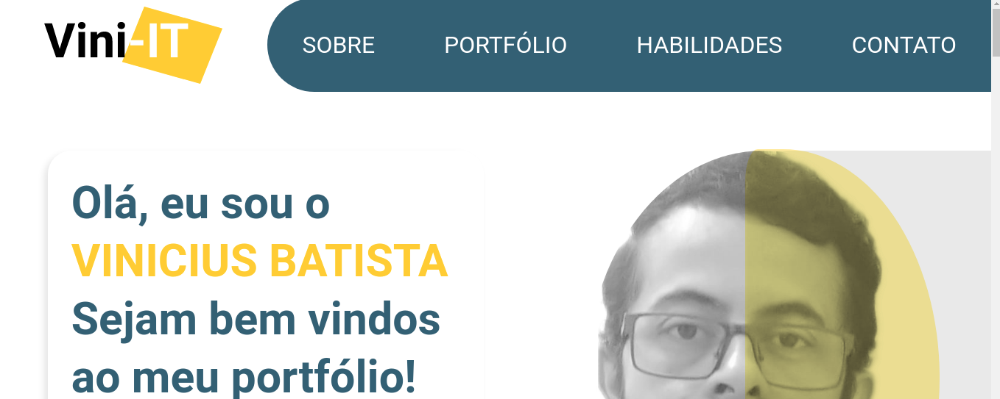

# Hello everyone, this is my first and offitial personal portfolio.

**Here I'll describe some step and share with you the setting that I used in this project.**

*PACKAGES*

01 - I builded the app using a server.js with express to call static paths to access all my files paths or routes in the future If I need. I followed this <a href="https://expressjs.com/pt-br/starter/static-files.html" target="_blank">DOC</a>

02 - I used this documantation for insert [SCROLLREAVEL](https://scrollrevealjs.org/guide/hello-world.html) in my project.

Package installed -> npm install scrollreveal --save

If you wanna see the progress off the project click <a href="http://vini-it-portfolio.vercel.app/" target="_blank" rel="noopener noreferrer">``here``</a>

*If you wanna see the progress off the project click <a href="http://vini-it-portfolio.vercel.app/" target="_blank" rel="noopener noreferrer">``here``</a>*

### Fill free to give a some feedback or suggestions, I'm open to hear your opinion.
