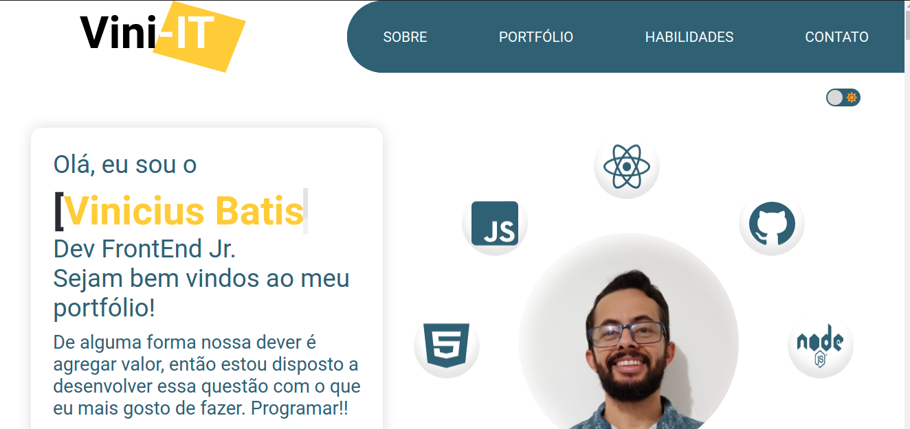

# Hello everyone, this is my first and offitial personal portfolio.

**Here I'll describe some step and share with you the setting that I used in this project**

*PACKAGES*

1 - I used this documantation for insert in my project [SCROLLREAVEL](https://scrollrevealjs.org/guide/hello-world.html)

Package installed -> npm install scrollreveal --save

*If you wanna see the progress off the project click <a href="http://vini-it-portfolio.vercel.app/" target="_blank" rel="noopener noreferrer">``here``</a>*

### Fill free to give a some feedback or sugestions, I'm open to hear you opinion.
